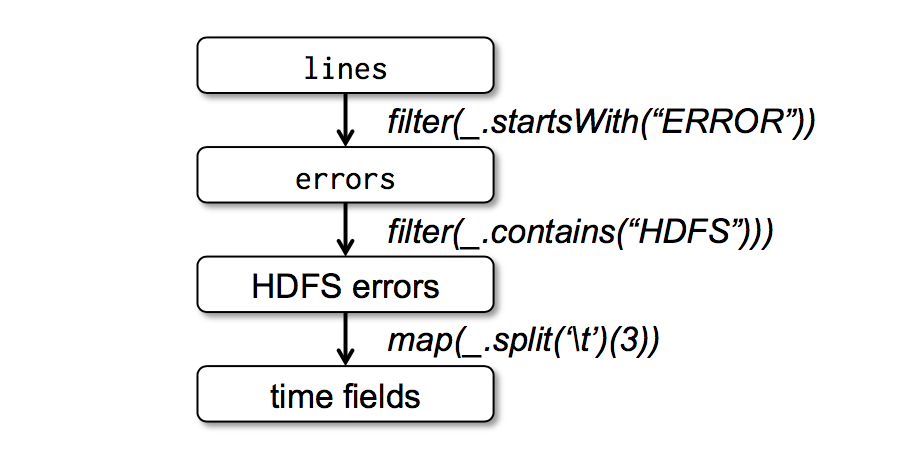

最近在看些计算框架的基础知识，为了比较好的了解Spark原理，我打算将其基石--[RDD这篇paper](https://www.usenix.org/system/files/conference/nsdi12/nsdi12-final138.pdf)粗翻一下，水平所限，不当之处，欢迎指出。

##摘要
我们提出了一种分布式弹性数据集的抽象（Resilient Distributed Datasets, RDDs），这种分布式的内存抽象能够让编程者使用大规模集群机器的内存进行计算，并且提供容错支持。RDD的提出是为了解决现有计算框架对两种计算模式：迭代式算法和交互式挖掘的不友好支持。在上述两种计算模式中，将数据保存在内存里都能极大的提高计算性能。为了更好的处理容错，RDDs提供严格的（译注：或者说简化的）内存共享方式，该方式只支持粗粒度的数据变换而非传统（译注：数据库）对共享状态以任意粒度的更新。然而，我们可以看到对于相当广泛的计算类型，RDDs的表达能力都是足够的。比如Pregel，一种专门为迭代式计算开发的模型，以及其他这些模型不能覆盖的类型，RDDs都能支持。我们在一个叫Spark的系统中实现了RDDs，利用该系统，我们对用户的各种应用场景和基准测试进行了评估。

##1 引言
像MapReduce[10]和Dryad[19]这样的集群计算框架已经被广泛应用于大规模的数据分析中。这些系统让用户免于关心底层多机和容错细节，仅利用一些抽象的高阶算子就能写出并行计算程序。
	尽管现有的框架提出了各种访问集群计算资源的抽象，他们都缺少对利用分布式内存的抽象。这使得他们不能够高效的满足近期出现的很重要的一类应用对于多轮计算中中间结果重用的需求。数据重用在一些迭代式的机器学习和图算法应用中很普遍，包括PageRank算法，K-means聚类和逻辑回归。另一类迫切的使用场景是交互式数据挖掘算法。在此场景下，用户常常对同一个数据集进行多轮次的即席查询。不幸之处在于，在大多数现有框架中，多轮计算（比如两轮的MapReduce任务）中间重用数据的唯一方式就是写到落地的存储系统中，比如分布式的文件系统。这样做会导致巨额的系统过载，因为数据备份，硬盘IO和序列化都会占用绝大比例的应用运行时间。
	意识到这些问题后，研究员们对一些需要数据重用的应用开发出了专用的框架。举例来说，Pregel[22]是一个交互式的图计算框架，它将中间数据保存在内存里；Haloop[7]提供一个迭代式的MapReduce接口。然而这些框架仅支持一些专用的计算模式（例如多步骤的MapReduce迭代），并且只在这些模式下进行隐式的数据共享。也就是说，它们并没有针对通用的计算模型提供一种有效的抽象，譬如让用户在加载多种数据集到内存后进行跨数据集间即席查询。
	于本论文中，我们提出了一种新的抽象，唤做可伸缩分布式数据集（Resilient Distributed Datasets, RDDs），藉此，使得一大类应用可以高效的进行数据重用。RDDs是一种通用的容错，并行的数据结构；它让用户对中间结果进行显式的内存驻留，自定义的分片置放，以及多样的算子操作。
	设计RDDs时一个首要挑战就是如何定义编程接口使得容错以高效。现存的对于集群内存的抽象，如分布式共享内存[24]，kv存储[25]，数据库和Piccolo[27]，都提供对可变状态的细粒度的更新（如表中的字段）。使用这种抽象，提供容错的方式就仅限于多机冗余备份和日志记录更新。对于数据密集型应用来说，不管哪种方式都是代价高昂。盖因其要求在集群网路间进行大量数据复制，而网络带宽远逊于RAM，由是招致客观的存储系统过载。
	与上述系统不同的是，RDDs提供一种基于粗粒度数据变换（如map，filter和join）的接口，这种变换对多个数据项执行同样的操作。此举将提供容错的方式变为通过记录变换过程而非备份数据本身来进行数据集（lineage）的重建。假使RDD的某个部分（partition）丢失了，RDD可以通过充分变换信息以及变换源集来进行该部分的重建。由是，遗失的数据通常可以很快的恢复，省去了冗余备份。
	尽管第一眼看上去，一个只提供粗粒度数据变换的接口具有诸多局限性，RDDs却能很好地适应多种并行应用，因为这些应用本质上都是作用于多个数据项上面的相同运算。事实上，我们发现RDDs可以高效的满足多个现有框架提出的模型，包括MapReduce，DryadLINQ，SQL，Pregel和HaLoop；并且能够满足这些框架没有覆盖的应用需求，如交互式的数据挖掘。我们认为，RDD抽象强大的最有力的证据就是，它能满足之前只有通过引入新框架才能提供的能力。
	我们在一个叫Spark的系统里实现了RDD，它被用于UC伯克利大学和一些公司的实验和生产环境中。Spark使用Scala语言[2]提供了一套类似于DryadLINQ[31]的语言整合编程接口。除此之外，Spark支持通过Scala解释器进行交互式的大数据集上的查询。我们深信Spark是第一款在大规模集群上支持通用编程语言以实时交互的速度进行内存上的数据挖掘系统。
	我们通过对于用户应用的小型基准评估来测试RDDs和Spark的性能。发现Spark在迭代式应用上快于Hadoop将近二十倍，将一个实际的数据分析加速了将近四十倍，并且能够在1TB数据集上以5-7s的延迟进行交互式的遍历。更重要的是，为了证明RDDs的通用性，我们在Spark上实现了以一个相当小的库（每库仅有两百多行）实现了Pregel和HaLoop编程模型，包括它们背后的存储位置的优化。
	本论文首先是RDD（第二节）和Spark（第三节）的概览，然后讨论了RDDs的内部表示（第四节），实现细节（第五节）和实验结果（第六节）。最后我们探讨了RDDs是如何获取了几个当前的集群编程模型（第七节），此外还有相关工作（第八节）和结论。

##2 可伸缩分布式数据集（RDDs）
这一部分提供了RDDs的概览。首先我们定义RDDs（2.1小节）并且介绍了在Spark中它们的编程接口（2.2小节）。接下来对比了RDDs和细力度的共享内存抽象。最后，讨论了RDD模型的限制。
###2.1 RDD抽象
正式来说，一个RDD是一个只读的，分片的数据记录集。RDDs是只能由(1) 落地数据 或(2)其他RDDs 通过确定性的运算得来。这些运算被称为变换以区别于RDDs之上的其他运算。这些变换操作包括map，filter和join。
	RDDs不需要随时被计算出来。相反，一个RDD有足够的信息记录了从其他数据集的变换序列以从落地储存得到它的每个部分的信息。这是一个优秀的性质：本质上，任何一个程序都不能引用一个不能从错误中重建的RDD。
	最后，用户可以控制RDDs两个其他方面的操作：持久化（persistence，译注：我觉得缓存好像更合适）和分片选择（partitioning）。用户可以指定某个RDDs为将来要重用的，并且选择一种存储策略（如，存在内存中）。用户也可以通过指定RDD元素的key（译注：以及基于该key的hash算法）来让RDD的元素在多个机器上进行分片存储。这对于存储位置优化很有用，譬如，可以让待join的两个数据集以同样的策略进行哈希和分片（译注：即路由到同一台机器上）。
###2.2 Spark编程接口
Spark通过像DyradLINQ[31]和FlumeJava[8]等语言整合的API对外提供RDDs服务，在其中，我们将每个数据集(dataset)表示为对象(object)，将变换（transformations）表示为作用于这些对象上面的函数调用。
	（译注：一个典型的流程是这样的）首先(start by)，编程者定义一些作用于离线存储（stable storage）上的变换（如map和filter）；然后，编程者可以将动作（actions）加诸于RDDs上。动作是一种可以将数据返回应用或者导出到存储系统的操作（译注：有点像终结符）。动作范畴的例子包括count（返回数据集内元素的个数），collect（返回数据集中所有元素本身）和save（将数据集中元素导入某个存储系统）。和DryadLINQ议案该，Spark会将所有对RDDs变换（transformations）操作延迟到第一次调用动作（actions）调用时，所以Spark能够将这些变换进行流水式编排（pipeline transformations）。
	此外，编程者可以调用persist函数，来声明将来运算中需要重用的RDDs。Spark默认将RDDs缓存在内存里，但当内存不够的时候，也会将RDDs刷到硬盘里。用户也可以通过改变persist函数的参数来指定其他缓存（译注：虽然原文是persist）策略，比如只存在硬盘里或者多机备份。最后，用户可以对不同RDD的缓存指定优先级，以确定其内存数据刷到硬盘上的先后顺序。
	
####2.2.1 示例：命令行日志分析
设想这样一个场景，一个网络服务出现了一些问题，运维人员想在存储于HDFS的数T级别的日志中找到原因。使用Spark，运维人员可以只将日志中的错误信息加载到多机内存里，并且进行交互式的查询。她首先需要编以下Scala代码：

```Scala
lines = spark.textFile("hdfs://...")
errors = lines.filter(_.startsWith("ERROR"))
errors.persist()
```
第一行定义了一个从HDFS文件（可以认为是一行行日志的集合）中加载的RDD，第二行从该RDD通filter变换生成一个新RDD。第三行指定`errors`缓存在内存里以便为多次查询共享数据。需要注意的时候，传递给filter的参数是Scala语法中的闭包。
	到现在为止，集群上没有执行任何运算（译注：因为只有action才能触发变换执行）。而，这时候用户可以在动作（actions）中使用该RDD，如统计日志条目的数量：
	
```Scala
errors.count()
```
用户也可以在此RDD上执行进一步的变换，并且使用输出结果，如下面几行代码：
	
```Scala
// Count errors mentioning MySQL:
errors.filter(_.contains("MySQL")).count()

// Return the time fields of errors mentioning HDFS 
// as an array (assuming time is field number 3 in 
// a tab-separated format)
errors.filter(_contains.("HDFS"))
	.map(_split('\t')(3))
	.collect()
```

当第一次涉及到`errors`数据集的动作执行的时候，Spark将`errors`的分片存到内存里，从而大大加速后续作用于该数据集的运算。注意到原始的RDD，`lines`没有被加载到RAM里，这是我们所期望的，因为错误信息日志可能只是整个数据的一小部分（足以在内存装得下）。

最后，为了说明我们的模型进行容错的过程，我们在图1里给出了第三个查询操作的运算谱系图。在该查询操作中，我们从`lines`filter得到`errors`，然后继续filter和map后进行collect。Spark的调度器将会对后两个变换运算进行流水化处理，然后分派一队任务到缓存有`errors`不同分片的节点上执行具体运算逻辑。并且，当`errors`的某个分片丢失时，Spark只需要在对应的源`lines`分片进行相应的运算就能重建它。
###2.3 RDD模型的优势
为了理解RDDs作为一个分布式的内存抽象带来的好处，我们在表1种将它和分布式共享内存（DSM）进行了比较。

Aspect | RDDs  | Distr. Shared Mem.
-------|-------|-------- 
Reads | Coarse- or fine-grained  |Fine-grained 
Writes |Coarse-grained |Fine-grained 
Consistency |Trivial (immutable) |Up to app/runtime 
Fault recovery |Fine-grained and low-overhead using lineage | Requires checkpoints and program rollback 
Straggler mitigation |Possible using backup tasks | Difficult 
Work placement | Automatic based on data locality |Up to app (runtimes aim for transparency) 
Behavior if not enough RAM |Similar to existing data flow systems |Poor performance (swapping?) 
<center>Table 1: Comparison of RDDs with distributed shared memory. 
</center>

在DSM系统中，应用可以在全局地址空间中对任意的位置进行读写。需要指出的是，在这种定义范畴下（DSM），不仅涵盖了经典的共享内存系统[24]，也包括了其他对共享状态进行细粒度读写的系统，包括但不限于Piccolo[27]。Piccolo提供了一个共享的DHT和分布式的数据库。DSM是一个很通用的抽象，但是它这种这种普适性也让其很难以一种高效并且容错的方式在大规模集群上进行实现。
RDDs和DSM见最主要的区别在于，RDDs只允许通过粗粒度的变换来实现写操作，而DSM允许对任意的内存进行随机读写。RDDs的这种设定给应用的批量写操作带来了一定限制，但也让它更高效的进行容错处理。还有，RDDs省去了由于引入备份点（checkpoints）而带来的额外负载，因为它可以通过操作谱系（lineage）进行错误恢复`(4)`。尤其是，只有某些丢失的RDD分区遇到错误时需要进行重新计算，并且不同分区（译注：由于在不同机器/节点上）可以进行并行的计算，而不用将整个运算（译注：即所有分区）进行回滚。
RDDs所带来的另外一个主要的优势在于，RDD的不可变性让系统可以像MapReduce[10]一样为运算缓慢的节点（拖后腿的那些机器）启动一些备份任务。而在DSM中就很难有这种骚操作了，因为备份任务和原任务可能会对同一个内存位置进行操作，造成互相干涉。
最后来说，RDDs还提供了两个DSM所没有的好处。第一个，对于RDDs上的批量操作，可以动态调度任务以充分利用局部性原来，从而提高性能。另一个，RDDs在内存不足的情况下可以进行平滑的降级，只要这些RDD仅被用于遍历性质的操作。那些不能够完全载入内存的分区可以被存在硬盘上，并且在现有的数据并行系统中可以提供和原来差不多的性能（译注：为啥？莫非是觉得硬盘的连续读比较快？）。
###2.4 不宜用RDDs的应用
正如引言部分所讨论的，RDDs很适用于对同一个数据集的所有元素进行同种运算的应用。在这种情况下，RDD可以将每个变换记为运算谱系图中的一部，并因此可以将丢失的分片进行高效的恢复，而不用去做大量的备份数据。RDDs不大适合那种需要对共享数据进行细粒度地更新的应用，比如网站应用和增量式的网络爬虫应用中的存储系统。对于这类应用来说，传统的基于更新日志和备份点恢复的系统更为高效，比如说数据库系统，RAMCloud[25]，Percolator[26]和Piccolo[27]。我们旨在为这种批量式分析需求提供一种高效的模型，将这些需要异步更新共享数据的需求留给其他专有系统去完成吧。


     


